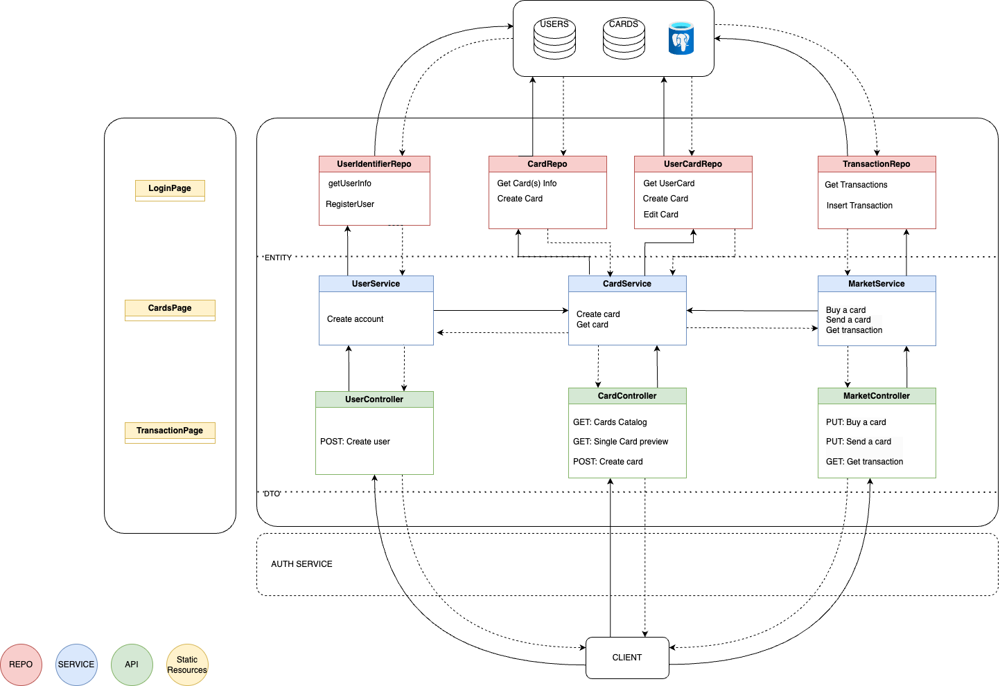
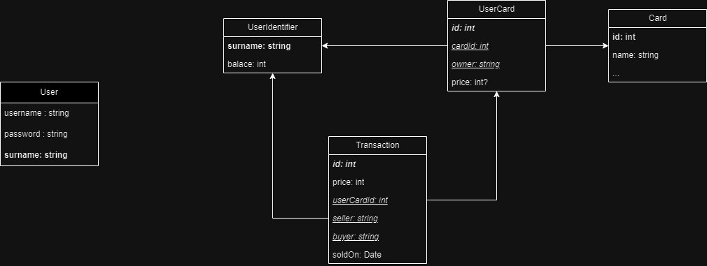

# Atelier 1
## **Bilan de Réalisation de l'Application**

### Architecture du projet

### Schéma de la base de données

### **Technologies Utilisées**

- **Spring Boot**: Cadre principal pour le développement de l'application.
- **Maven**: Outil de gestion de dépendances.
- **JPA/Hibernate**: Pour la gestion des entités et l'interaction avec la base de données.
- **Postgres sous docker:** Base de données.

### **Fonctionnalités Implémentées**

1. **Création d'utilisateur et connexion**:
    - **Inscription**: Endpoint permettant la création d'un nouvel utilisateur avec stockage en base de données.
    - **Connexion**: Endpoint permettant l'authentification de l'utilisateur à partir de ses identifiants.
2. **Achat/vente de cartes**:
    - **Réception de cartes**: Chaque utilisateur reçoit aléatoirement 5 cartes à l'inscription.
    - **Achat de cartes**: Endpoint permettant à un utilisateur d'acheter une carte.
    - **Vente de cartes**: Endpoint permettant à un utilisateur de vendre une carte.

### **Structure du Projet**

- **Entities**:
    - **`User`**: Représente un utilisateur de la plateforme au niveau de l’authentification.
    - **`Card`**: Représente une carte de jeu.
    - **`Transaction`**: Représente une transaction d'achat ou de vente de carte.
    - **`UserCard` :** Représente la carte d’un joueur.
    - **`UserIdentifier` :** Représente un utilisateur de la plateforme au niveau des cartes.
- **Repositories**:
    - **`UserRepository`**
    - **`CardRepository`**
    - **`TransactionRepository`**
    - **`UserCardRepository`**
    - **`UserIdentifierRepository`**
- **Services**:
    - **`UserService`**
    - **`CardService`**
    - **`MarketService`**
    - **`Services d'authenfication`**
- **Controllers**:
    - **`UserController`**
    - **`CardController`**
    - **`MarketController`**

### **Endpoints Principaux**

- **Utilisateur**:
    - **`POST /register`**: Inscription d'un nouvel utilisateur.
    - **`POST /login`**: Authentification de l'utilisateur.
- **Cartes**:
    - **`GET /api/cards`**: Récupérer les cartes.
    - **`POST /api/usecards/{userCarId}/buy`**: Acheter une carte.
    - **`POST /api/usecards/{userCarId}/sell`**: Vendre une carte.

## **Comparatif des Architectures Logicielles**
| Critère | MVC (Model-View-Controller) | SOA (Service-Oriented Architecture) | Microservices |
| --- | --- | --- | --- |
| Complexité | Modérée, bien adaptée aux petites et moyennes applications. | Modérée à élevée, nécessite une bonne gestion des services. | Élevée, nécessite une gestion fine des composants. |
| Couplage | Faible entre les couches, mais fort entre les composants de chaque couche. | Faible entre les services, chaque service étant indépendant. | Très faible, chaque service est indépendant et autonome. |
| Déploiement | Monolithique, déploiement en une seule unité. | Par service, mais souvent groupé. | Individuel, chaque service est déployé séparément. |
| Scalabilité | Limitée par l'architecture monolithique. | Bonne, chaque service peut être mis à l'échelle indépendamment. | Excellente, chaque microservice peut être mis à l'échelle indépendamment. |
| Maintenance | Facile, une seule base de code. | Moyenne, gestion des interfaces de service. | Complexe, chaque microservice a sa propre base de code. |
| Exemples d'utilisation | Applications web classiques, CRUD. | Grandes entreprises avec des systèmes intégrés. | Grandes entreprises, applications nécessitant une scalabilité élevée et une résilience. |
