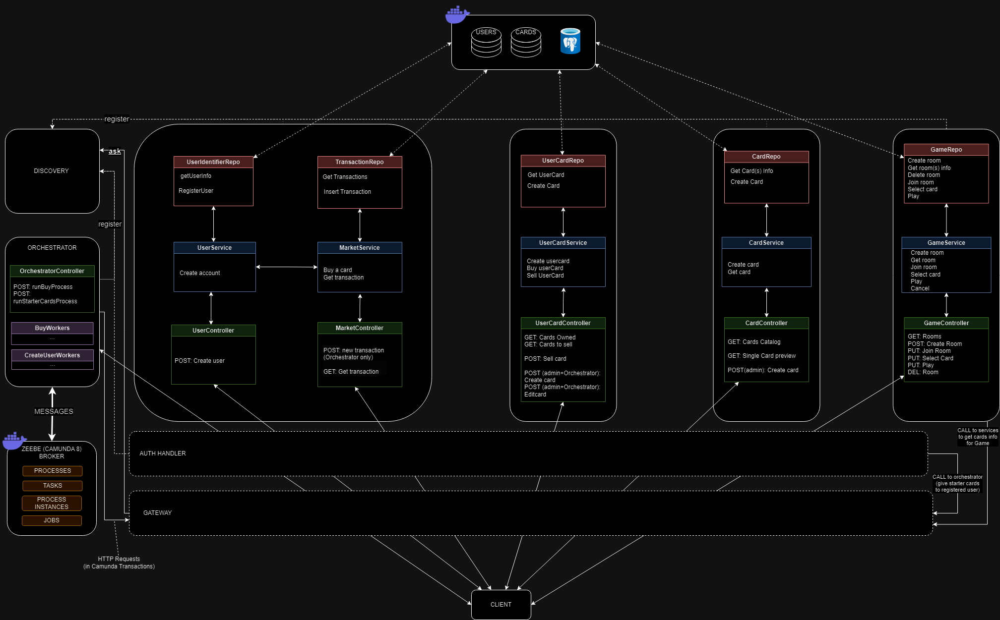
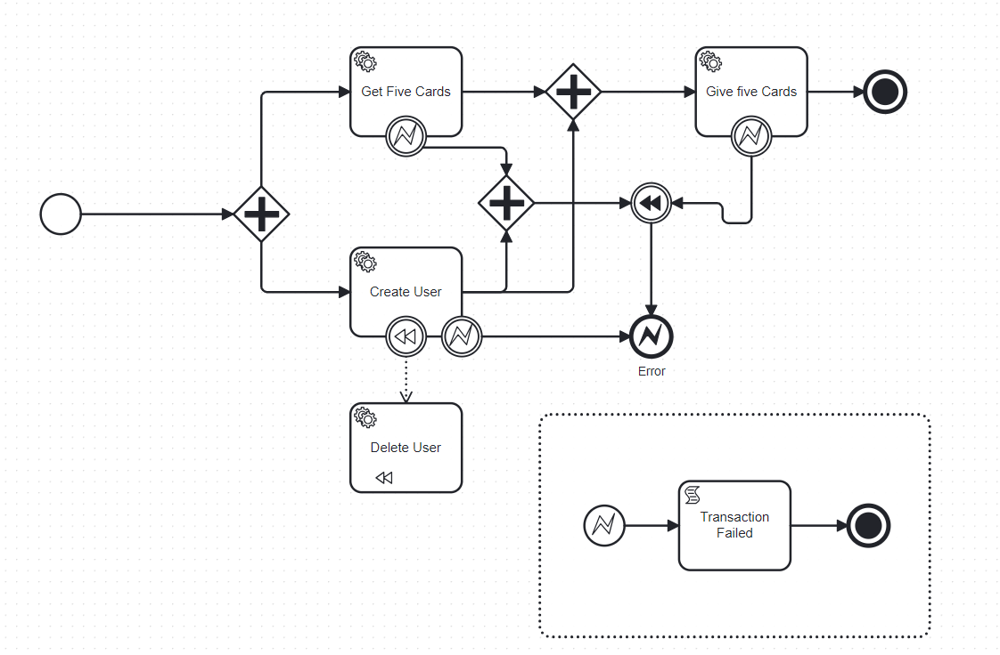
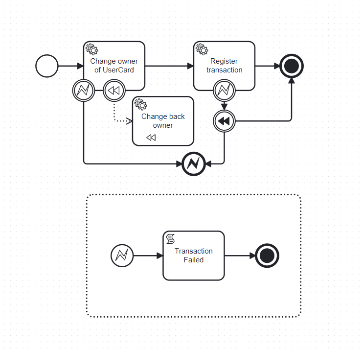

# Atelier 3 - ASI 1
Léon DUMESTRE
Léo BARBIER
Louis CHARNAY
Josse DE OLIVEIRA
## **Bilan de Réalisation de l'Application**

### Architecture du projet

### Découpage en microservices OK:
- Léo (CardService)
- Louis (UserService)
- Josse (UserCardService, AuthService)

### Autres APIs OK:
- Louis (Gateway + corrections front-end)
- Léon (Discovery, GameService)
- Josse (Orchestrator)

### Tests OK (coverage > 25%  pour AuthService, CardService, UserCardService et UserService):
- Léon (AuthService, GameService)
- Josse (CardService, userService, UserCardService)
- Léo (CI github+Sonar)

+ Le SAGAS a été implémenté avec CAMUNDA 8.
+ 
+ On a un jeu fonctionnel mais qui repose sur des règles très simple, la logique est présente mais nous n'avons pas eu le temps de la tester dans l'intégralité.

### Rendu:
- Léo (vidéo)
- Léon (ZIP et dépot)
- Louis, Josse, Léon, Léo (rédaction pdf)